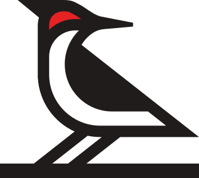

<h1>&nbsp; Underlay</h1>

Underlay is a protocol for giving structured data a permanent address. You push JSON records and a JSON Schema. You get back a versioned, content-addressed snapshot you can point to forever.

Every piece of content — records, schemas, and files — is identified by its SHA-256 hash. A version is a tree of those hashes with a single root hash, so versions share the data they have in common, transfers only move what the other side doesn't have, and provenance is built in: a record's hash finds the collections and versions that include it.

Schemas are first-class objects: inspectable, comparable, and alignable across independently authored datasets. Two collections that independently publish an identical Author schema share its schema hash — alignment falls out of the data model automatically. The infrastructure doesn't need to solve interoperability. It provides enough structure that interoperability can be solved dynamically by the tools and models that consume the data.

The protocol is simple: push records in, pull records out, trust the versions. The intelligence lives in the actors, not the store. The reference implementation runs at [underlay.org](https://underlay.org).

Built by [Knowledge Futures](https://www.knowledgefutures.org), a 501(c)(3) public charity.

## Repository layout

This branch is Underlay v2: one codebase that runs on Cloudflare Workers (D1, R2, Queues) and,
for development and tests, on Node (SQLite, S3 or the filesystem). It is a pnpm workspace:

| Package                                    | What it is                                                                                                                                                                                                                    |
| ------------------------------------------ | ----------------------------------------------------------------------------------------------------------------------------------------------------------------------------------------------------------------------------- |
| `packages/protocol` (`@underlay/protocol`) | The format: canonical JSON, hashing, validation, trees, version roots, the repository layout, the signed version log, tree sync and `fsck`. Stores for memory, the filesystem, S3 and R2. Runs in Node, Workers and browsers. |
| `packages/server` (`@underlay/server`)     | The Hono app: API, push and commit, files, jobs, billing counters, storage locations. Worker entry `src/worker.ts`, Node entry `src/node/main.ts`. Migrations in `drizzle/`.                                                  |
| `packages/web` (`@underlay/web`)           | The UI: React Router pages rendered on the server by both entries, plus the client bundle.                                                                                                                                    |
| `packages/cli` (`@underlay/cli`)           | The command line: a local repository, pull by tree sync, push by delta push.                                                                                                                                                  |
| `packages/migrate` (`@underlay/migrate`)   | Converts a v1 (Postgres) instance into v2.                                                                                                                                                                                    |

`docs/protocol-v2.md` is the specification of Underlay protocol v2, with test vectors in
`packages/protocol/test/vectors/`. `docs/v1-read-api.md` is the inventory of v1's read API that
v2 was built against, and what v2 changes.

## Development

Node 24 and pnpm 10.

```bash
pnpm install
pnpm typecheck        # every package
pnpm test             # every package's tests
pnpm lint && pnpm fmt:check
```

Run the app on Node with SQLite and blobs on disk (port 4200); migrations apply on start:

```bash
pnpm --filter @underlay/web build
DB_URL=file:/tmp/ul.sqlite BLOB_DIR=/tmp/ul-blobs npx tsx packages/server/src/node/main.ts
```

`pnpm --filter @underlay/server dev:node` runs the same entry under `tsx watch`.
`packages/server/src/node/main.ts` lists the Node environment variables (S3, KF Auth, signing
and location keys); without them it uses development secrets and a throwaway signing key, and
sign-in points at a local KF Auth. The Node entry is for development only.

Other checks CI runs: `pnpm --filter @underlay/protocol check-browser` (the browser bundle),
`pnpm --filter @underlay/cli build`, and `pnpm --filter @underlay/web build && pnpm --filter
@underlay/web smoke` (server-rendered pages).

## Deployment

Each deployment is a wrangler env in `packages/server/wrangler.jsonc` with its own Worker, D1
database, bucket and queues: `staging` (staging.underlay.org) and `prod` (next.underlay.org, not
yet provisioned: its D1 id is a placeholder):

```bash
pnpm --filter @underlay/web build
cd packages/server
npx wrangler d1 migrations apply underlay-staging --env staging --remote   # new migrations only
npx wrangler deploy --env staging
```

Secrets are SOPS-encrypted per deployment (`.env.staging.enc`); decrypt them into the shell, never
to a file. Add migrations with `cd packages/server && npx drizzle-kit generate --name <name>`;
never edit one that a deployment has applied.

## License

MIT. See [LICENSE](LICENSE).
